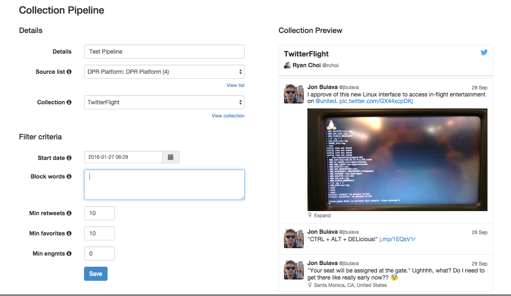

Twitter Collections Sample
=================

Sample Django App that allows a user to identify top tweets (by engagements, filter words) and populate
them into Collections. This can logically be used/extended for automated purposes as well.

As always, when developing on top of the Twitter platform, you must abide by the [Developer Agreement & Policy](https://dev.twitter.com/overview/terms/agreement-and-policy). 

Requirements
============

To run this sample code, you'll need to install the following libraries:

- Python Social Auth (https://github.com/omab/python-social-auth)
- Python Twitter (https://github.com/bear/python-twitter)
- south (http://south.aeracode.org/)
- Fabric (http://www.fabfile.org/)

You can install these with the following command:

	pip install -r requirements.txt
	
Additionally, this code sample requires that your Twitter App has Collections enabled. You can get your app
enabled for Collections by generating a token via [Fabric](https://fabric.io) or working with your Partner
Manager to enable it for existing tokens.

Getting Started
============

- Create a Twitter App (https://apps.twitter.com/)

- In the Twitter App config, ensure the Callback URL is `http://127.0.0.1:9000/complete/twitter`

- In the settings.py or settings_my.py, set the following to your own key:

    SECRET_KEY = 'YOUR_SECRET_KEY'

- Specify your Twitter API credentials in app/settings_my.py under the following section:

    SOCIAL_AUTH_TWITTER_KEY = ''
    
    SOCIAL_AUTH_TWITTER_SECRET = ''
    
    TWITTER_ACCESS_TOKEN = ''
    
    TWITTER_ACCESS_TOKEN_SECRET = ''

- To initialize your database, run the from the `django-rest-apis` directory:

  `python manage.py syncdb --settings=app.settings_my`
  
  Then run:
  
  `python manage.py migrate --settings=app.settings_my`

- To start the server, run the following from the `collection-pipes` directory:

  `fab start`
  
- Open a browser and go to http://127.0.0.1:9000

Deploying to Heroku
============

Deploying to Heroku is even easier. The defaults in settings.py are pre-configured  to easily deploy to Heroku.

- Create a Twitter App (https://apps.twitter.com/)
- Click on the Heroku button below
- When prompted during the Heroku install, specify your:

	- CONSUMER_KEY
	- CONSUMER_SECRET
	- ACCESS_TOKEN
	- ACCESS_TOKEN_SECRET
	
- After deploying, in the Twitter App config, ensure the Callback URL is `http://your-app-name.herokuapp.com/complete/twitter`

- To sync the database, use the Heroku CLI and run the following:

	`heroku run python manage.py syncdb --app your-app-name`
	`heroku run python manage.py migrate --app your-app-name`
	
- Open a browser and go to the URL specified by your deploy (http://your-app-name.herokuapp.com)

- To create an admin user, use the following Heroku CLI command:

	`heroku run python manage.py shell --app your-app-name`
	
Then query for your initial user and update their profile as follows:

	`heroku run python manage.py createsuperuser`

NOTES
============
If you receive a 401 at login/twitter it is most likely caused by a datetime discrepancy between the server making the requst and the Twitter server.

Use NTP to sync time on your server to compensate for the dift.

If you are getting this error on OSX, toggle the "set time zone" checkbox off and back on in Date & Time system preferences for a manual and temporary fix. It has been reported that OSX 10.9 Mavericks has an issue with time drift.

